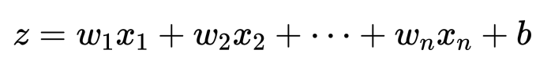
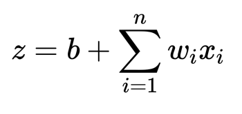

# Linear-Logistic_Regression

**수치 예측을 위한 선형 회귀 / 이진 분류를 위한 로지스틱 회귀를 배워봅니다.**

## Linear Regression

먼저 선형 회귀는 우리가 배운 1차 함수와 비교하여 간단하게 파악할 수 있습니다.  

<pre><code>y = ax + b</code></pre>

위의 식은 우리가 흔히 볼 수 있는 1차 함수의 식입니다.  
저희는 위 식에서 'a'를 기울기 'b'를 절편이라고 학교에서 배웠었죠.  

그리고 기울기(a)와 절편(b)이 각각 주어진 상태에서 저희는 'y'값에 따른 'x'값을 구했었습니다.  

<pre><code>y = 7x + 4</code></pre>

예를 들면, 위의 식은 기울기가 7, 절편이 4인 1차 함수입니다.  
위 식에서 y = 25라면? x = 3임을 구하는 것이 저희가 배웠었던 1차 함수의 문제 해결이죠.  

그렇다면 이제 본격적으로 선형 회귀의 문제 해결에 대해 알아봅시다.  

<pre><code>H(x) = Wx + b</code></pre>

다시 한 번 위에서의 1차 함수와 같은 식을 기호만 조금 변형해서 가져왔습니다. 
우리는 이를 가설함수라고 부르며, 보통 기울기 대신 가중치('W')라고 표현합니다. 

이번에는 반대로 'x'값과 'H(x)'값들이 주어진 상태에서, 기울기(a)와 절편(b)를 구해볼겁니다.  

| X | H(X) |
|:--:|:--:|
| 1 | 11 |
| 2 | 18 |
| 3 | 25 |
| 4 | 32 |
| 5 | 39 |
| 6 | 46 |

위와 같이 X, Y값들을 데이터로써 기울기와 절편을 학습시켜 가장 오차율이 적은 값을 얻어내는 것이 선형 회귀라고 이해하면 될 것 같습니다.  

  - - -

## Logistic Regression

하지만 만약 데이터가 아래와 같다면 어떨까요?

| X | H(X) |
|:--:|:--:|
| 1 | 0 |
| 2 | 0 |
| 3 | 0 |
| 4 | 1 |
| 5 | 1 |
| 6 | 1 |

3 이하의 수는 0 이고, 4 이상의 수는 1임을 알 수 있습니다. 우리는 위와 같은 문제를 이진 분류 문제라고 합니다.  
이진 분류 문제는 예를 들면 불량 판별이나 생존자 예측 문제와 같이 값이 0, 1로만 나오는 문제가 이에 해당합니다.  

  

위와 같이 이진 분류 문제는 기존 선형회귀로 예측하기에는 무리가 있었습니다.

### Perceptron

1957년 이진 분류 문제에서 최적의 가중치를 학습하는 퍼셉트론이 처음 발표되었습니다.  

위의 사진과 같이 퍼셉트론은 각 특성 별 선형 함수를 통해 값을 내어 
계단 함수를 통해 0과 1로 분류합니다.   
 
특성 n개의 선형 함수를 위와 같이 식으로 표현할 수 있습니다.  

 
정리하면 위와 같은 식으로 표현할 수 있습니다. 

우리가 선형 함수를 통해 낸 값을 계단 함수를 통해 0과 1로 분류한다고 했었습니다.  
계단 함수(Step Function)는 값이 0보다 적으면 0으로, 0보다 크면 1로 분류해주는 함수입니다.   

